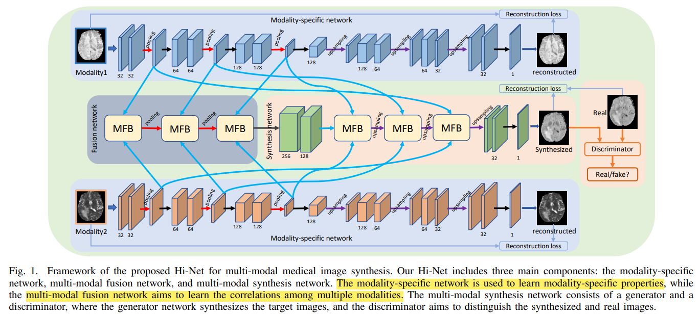
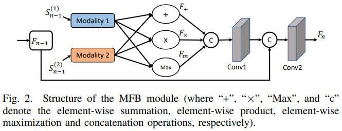
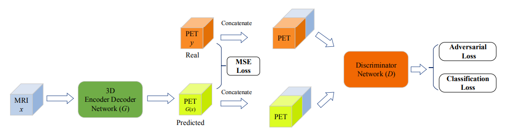
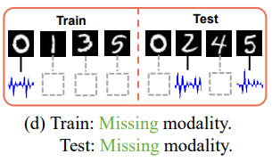
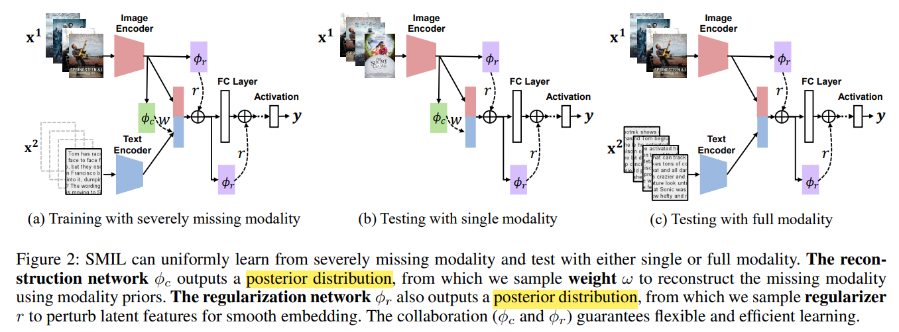

# Learning from incomplete data

## Papers

Li S C X, Jiang B, Marlin B. MisGAN: Learning from Incomplete Data with Generative Adversarial Networks[C]//**International Conference on Learning Representations**. 2018. [[paper]](https://arxiv.org/pdf/1902.09599.pdf)

Mattei P A, Frellsen J. MIWAE: Deep generative modelling and imputation of incomplete data sets[C]//**International Conference on Machine Learning**. PMLR, 2019: 4413-4423. [[paper]](http://proceedings.mlr.press/v97/mattei19a/mattei19a.pdf)

Shen H T, Zhu Y, Zheng W, et al. Half-quadratic minimization for unsupervised feature selection on incomplete data[J]. **IEEE transactions on neural networks and learning systems**, 2020. [[paper]](https://ieeexplore.ieee.org/abstract/document/9153124/)

Li R, Zhang W, Suk H I, et al. Deep learning based imaging data completion for improved brain disease diagnosis[C]//**International Conference on Medical Image Computing and Computer-Assisted Intervention**. Springer, Cham, 2014: 305-312. [[paper]](https://link.springer.com/content/pdf/10.1007/978-3-319-10443-0_39.pdf)

Zhou T, Fu H, Chen G, et al. Hi-net: hybrid-fusion network for multi-modal MR image synthesis[J]. **IEEE transactions on medical imaging**, 2020, 39(9): 2772-2781. [[paper]](https://arxiv.org/pdf/2002.05000.pdf)

Cai L, Wang Z, Gao H, et al. Deep adversarial learning for multi-modality missing data completion[C]//**Proceedings of the 24th ACM SIGKDD International Conference on Knowledge Discovery & Data Mining**. 2018: 1158-1166.

Ma M, Ren J, Zhao L, et al. Smil: Multimodal learning with severely missing modality[C]//**Proceedings of the AAAI Conference on Artificial Intelligence**. 2021, 35(3): 2302-2310.

## Notes

### MisGAN

### MIWAE

### Half-quadratic minimization

### MICCAI 2014 Brain Disease

- trained on subjects with all modalities(MRI and PET images)
- estimate the output modality given the input modality
- use 3D-CNN

### Hi-Net

- Use **Medical Image Synthesis** to solve missing modalities problem.
- **Modality-specific network** is an *autoencoder* network
- **Fusion network** is used to fusion different modalities by *concatenating* different fusion methods
- **Synthesis network** is a *pix2pix-liked* GAN model
- **Experiments** on MRI
  - $T_1+T_2\to Flair$
  - $T_1+Flair \to T_2$

### Deep Adversarial Learning for Missing Data Completion

- pix2pix-liked network

### SMIL

- Problem

- Method
  - Bayesian Meta-Learning

