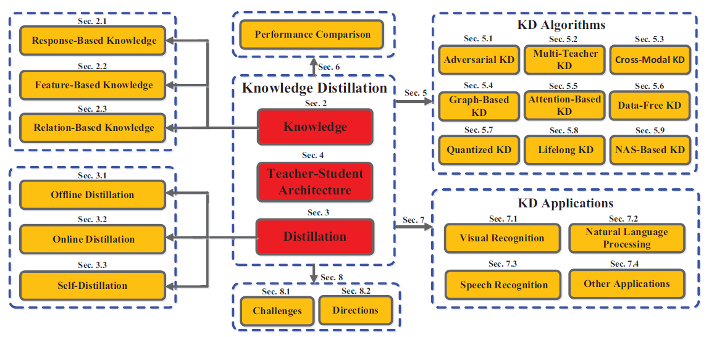
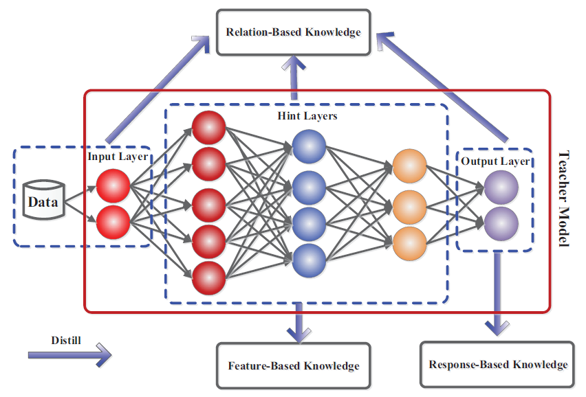
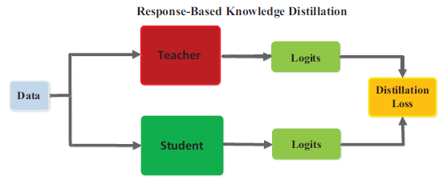
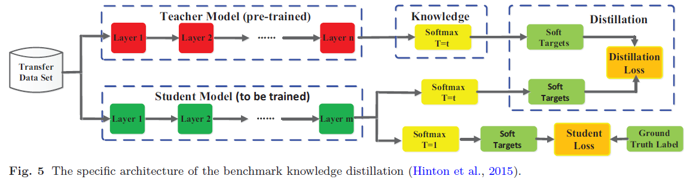
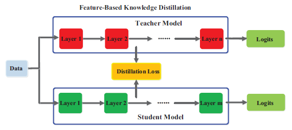
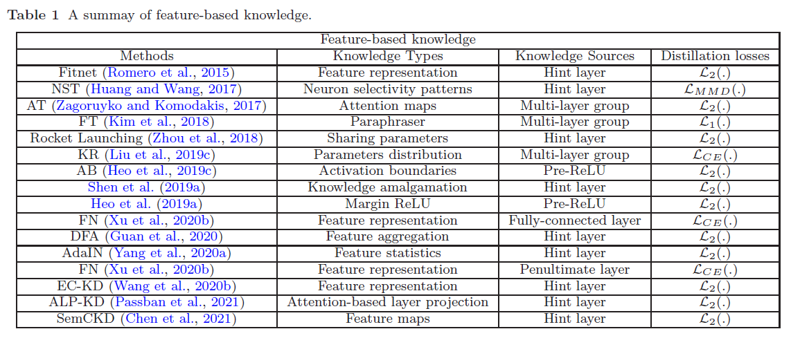
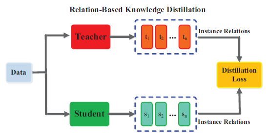
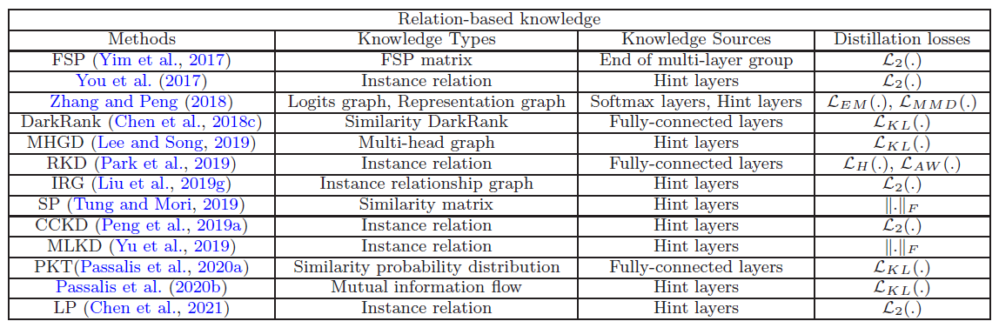
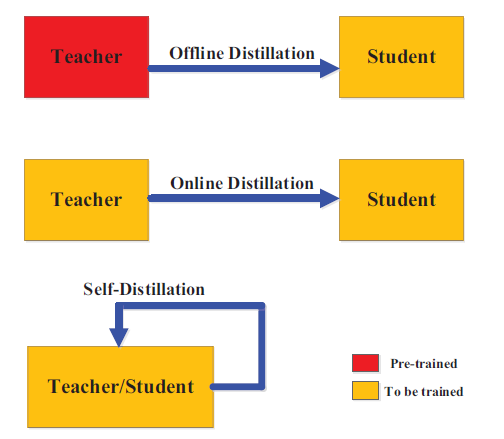
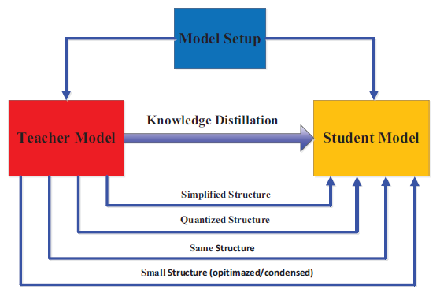

# Knowledge Distillation

## Survey

[Gou J, Yu B, Maybank S J, et al. Knowledge distillation: A survey[J]. International Journal of Computer Vision, 2021, 129(6): 1789-1819.](https://arxiv.org/abs/2006.05525)

## Repos

[FLHonker/Awesome-Knowledge-Distillation](https://github.com/FLHonker/Awesome-Knowledge-Distillation)

[dkozlov/awesome-knowledge-distillation](https://github.com/dkozlov/awesome-knowledge-distillation)

[peterliht/knowledge-distillation-pytorch](https://github.com/peterliht/knowledge-distillation-pytorch)

[AberHu/Knowledge-Distillation-Zoo](https://github.com/AberHu/Knowledge-Distillation-Zoo)

## Note

Knowledge Distillation is one of model compression and acceleration techniques. Other techniques include 1) Parameter pruning and sharing; 2) Low-rank factorization; 3) Transferred compact convolutional filters

The framework of KD is shown below.

### Knowledge

#### Response-Based Knowledge

- use the last output layer of the teacher model
- Distillation loss is defined as $L_{ResD}(z_t,z_s)= \mathcal{L}_{R}(z_t,z_s)$​​, $\mathcal{L}_R$​ indicates **divergence loss**

- **Distillation loss** for soft targets $L_{ResD}(p(z_t,T),p(z_s,T))=\mathcal{L}_R(p(z_t,T),p(z_s,T))$​ where $p(z_i,T)=\frac{exp(z_i/T)}{\sum_jexp(z_j/T)}$$L_{ResD}(z_t,z_s)= \mathcal{L}_{R}(z_t,z_s)$​, $\mathcal{L}_R$​​ often employs **Kullback Leibler divergence loss**
- **Student loss** is always defined as the cross-entropy loss $\mathcal{L}_CE(y,p(z_s,T=1))$
- Since the soft logits are in fact the class probability distribution, the response-based knowledge distillation is also limited to the supervised learning.

#### Feature-Base knowledge

- Distillation loss for feature-based knowledge transfer: $L_{FeaD}(f_t(x),f_s(x))=\mathcal{L}_F(\Phi_t(f_t(x)),\Phi_s(f_s(x)))$​, $f(x)$​​ are the feature maps of the intermediate layers. The transformation functions $\Phi(.)$ are applied when the feature maps between teacher and student models are not in the same shape. $\mathcal{L}_F(.)$ indicates the similarity function.
- How to effectively choose the hint layers remains to be further investigated
- Due to the significant differences between sizes of hint and guided layers, how to properly match feature representations of teacher and student also needs to be explored.

#### Relation-Base Knowledge

- Distillation loss: $L_{RelD}(F_t,F_s)=\mathcal{L}_{R^2}(\Psi_t(t_i,t_j),\Psi_s(s_i,s))$

- $F_t$ and $F_s$ are the sets of feature representations from the teacher and student models
- $\Psi_t(.)$ and  $\Psi_s(.)$ are the similarity functions of $(t_i, t_j)$ and $(s_i, s_j)$.
- $L_{R^2} (.)$ is the correlation function between the teacher and student feature representations.

### Distillation Schemes

#### Offline Distillation

- One way
- The capacity gap between large teacher and small student always exists
- Student often largely relies on teacher.

#### Online Distillation

- teacher model and the student model are updated simultaneously
- the whole knowledge distillation framework is end-to-end trainable

- However, existing online methods (e.g., mutual learning) usually fails to address the high-capacity teacher in online settings

#### Self-Distillation

- student learn knowledge by oneself

### Teacher-Student Architecture

- Simplified Structure:  same architecture, fewer layers and fewer channels
- Quantized Structure: the structure of the network is preserved

- Small Structure: a small network with optimized global network structure **or** a small network with efficient basic operations
