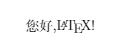

# LaTeX

## Installation [TeXLive + WSL2+ VSCode]

### Install TeXLive on WSL2

Check out the official [quick installation instructions](https://www.tug.org/texlive/quickinstall.html).

#### Pre-install

```bash
# download installation file
wget https://mirror.ctan.org/systems/texlive/tlnet/install-tl-unx.tar.gz
# unzip
tar -xzvf install-tl-unx.tar.gz
```

#### Install

```bash
cd install-tl-20210907
sudo ./install-tl
```

#### Setting PATH

Open `~/.bashrc`, add the following command to the file

```bash
export PATH=/usr/local/texlive/2021/bin/x86_64-linux:$PATH
```

#### Testing

Type the following command

```bash
latex small2e
```

and you should see something like this

```bash
This is pdfTeX, Version 3.141592653-2.6-1.40.23 (TeX Live 2021) (preloaded format=latex)
 restricted \write18 enabled.
entering extended mode
(/usr/local/texlive/2021/texmf-dist/tex/latex/base/small2e.tex
LaTeX2e <2021-06-01> patch level 1
L3 programming layer <2021-08-27>
(/usr/local/texlive/2021/texmf-dist/tex/latex/base/article.cls
Document Class: article 2021/02/12 v1.4n Standard LaTeX document class
(/usr/local/texlive/2021/texmf-dist/tex/latex/base/size10.clo))
(/usr/local/texlive/2021/texmf-dist/tex/latex/l3backend/l3backend-dvips.def)
No file small2e.aux.
(/usr/local/texlive/2021/texmf-dist/tex/latex/base/omscmr.fd) [1]
(./small2e.aux) )
Output written on small2e.dvi (1 page, 1864 bytes).
Transcript written on small2e.log.
```

### Use TeXLive in VSCode

Install `LaTeX Workshop` in `MARKETPLACE` then everything is ready if you only use English in writing.

### TeXLive Configuration with CTeX (for writing Chinese)

`CTeX` is bundled with TeXLive, however the default `LaTeX Workshop` Compiler would raise the following error when working with `CTeX`.

```bash
critical package ctex error:ctex fontset"fandol" is unavailable in current
```

Hence, we need to setup `xelatex` for compiling.

Firstly, open `VSCode Setting`, search `latex.tools`, click `Edit in setting.json` and append the following setting 

```bash
{
	"name": "xelatex",
	"command": "xelatex",
	"args": [
		"-synctex=1",
		"-interaction=nonstopmode",
		"-file-line-error",
		"%DOC%"
	],
	"env": {}
}
```

Secondly, open `VSCode Setting`, search `latex.recipes`, click `Edit in setting.json` and append the following setting 

```bash
{
	"name": "xelatex",
	"tools": [
		"xelatex"
	]
},
{
	"name": "xelatex ➞ bibtex ➞ xelatex*2",
	"tools": [
		"xelatex",
		"bibtex",
		"xelatex",
		"xelatex"
	]
}
```

Create a `text.tex` file below and use  `Recipe: xelatex` to compile. You should see it compile successfully now.

```tex
\documentclass{ctexart}
\begin{document}
您好,\LaTeX!
\end{document}
```



