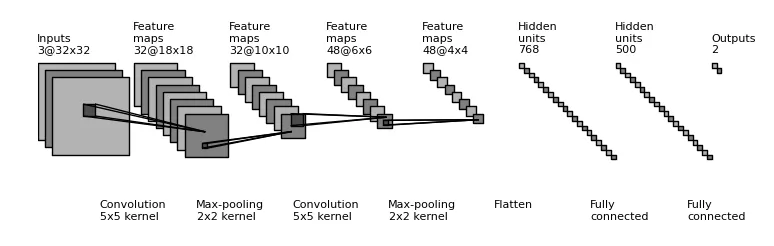
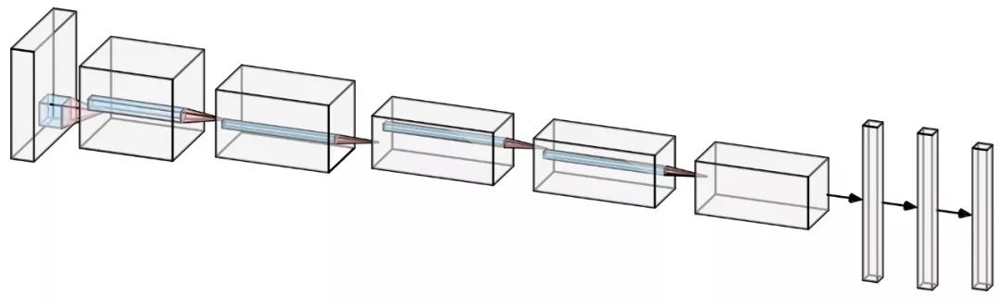
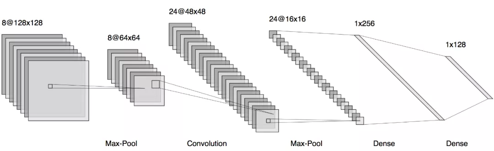
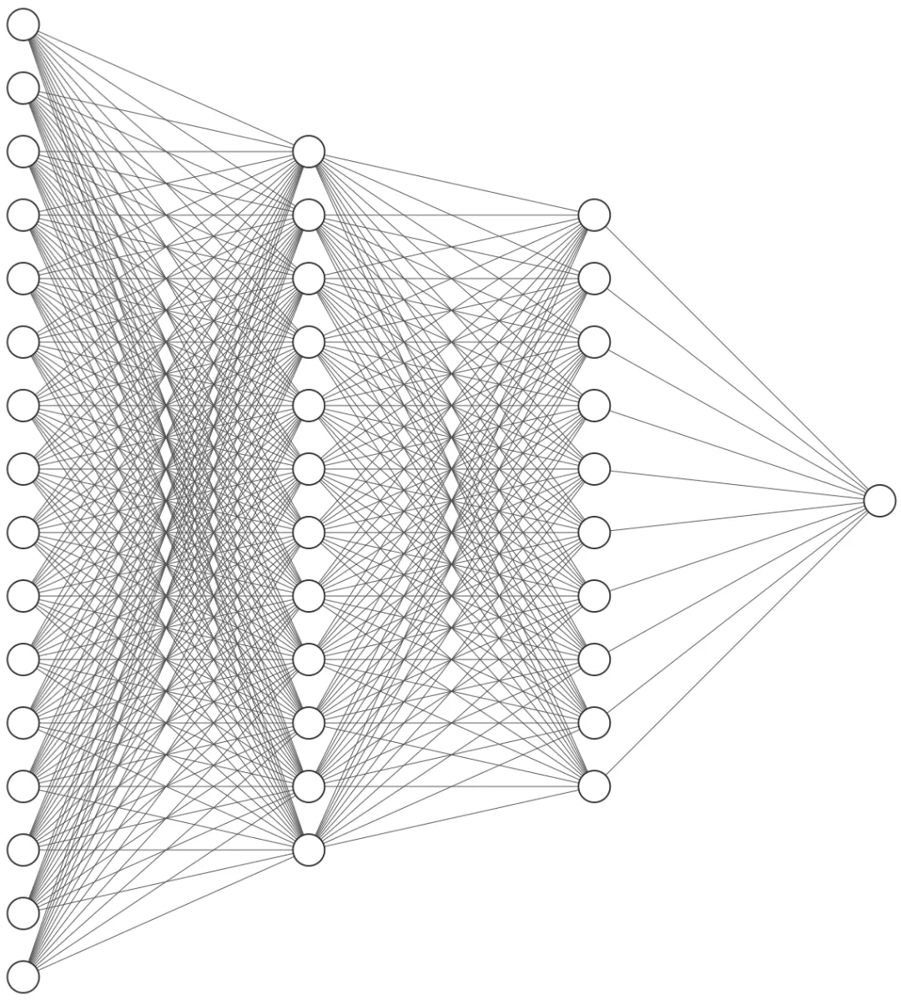
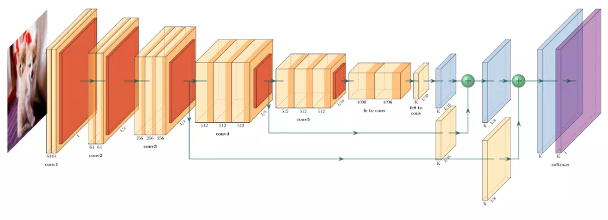
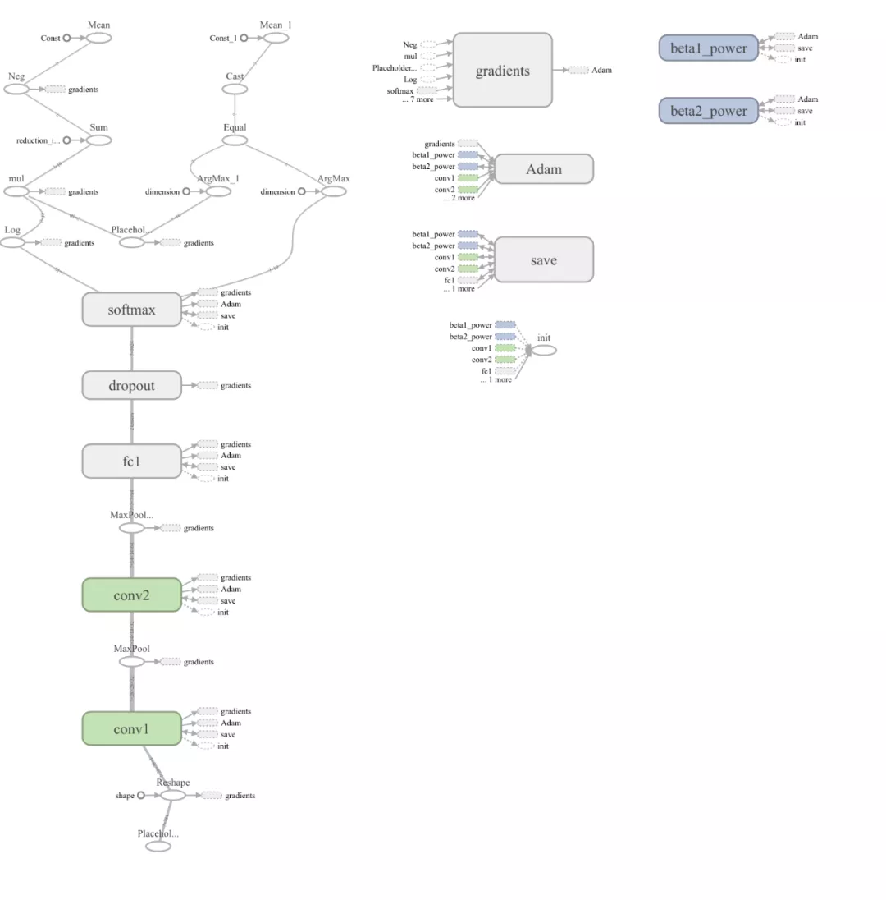

# How to draw CNN

1. [draw_convnet](https://github.com/gwding/draw_convnet)

   

2. [NNSVG](http://alexlenail.me/NN-SVG/LeNet.html)

   

   

   

3. [PlotNeuralNet](https://github.com/HarisIqbal88/PlotNeuralNet)

   

4. [Tensorboard](https://www.tensorflow.org/tensorboard/graphs)

   

