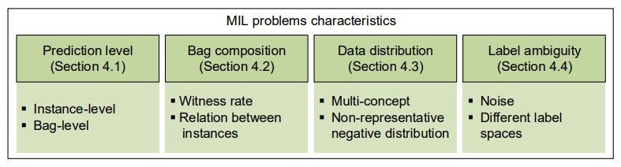

#  Multi-instance learning

## Survey

Zhou Z H. Multi-instance learning: A survey[J]. Department of Computer Science & Technology, Nanjing University, Tech. Rep, 2004, 1. [[paper]]()

Cheplygina V, de Bruijne M, Pluim J P W. Not-so-supervised: a survey of semi-supervised, multi-instance, and transfer learning in medical image analysis[J]. Medical image analysis, 2019, 54: 280-296. [[paper]](https://arxiv.org/pdf/1804.06353.pdf)

Carbonneau M A, Cheplygina V, Granger E, et al. Multiple instance learning: A survey of problem characteristics and applications[J]. Pattern Recognition, 2018, 77: 329-353.

Ilse M, Tomczak J M, Welling M. Deep multiple instance learning for digital histopathology[M]//Handbook of Medical Image Computing and Computer Assisted Intervention. Academic Press, 2020: 521-546. [[book]](http://library.lol/main/CC6B55E1A7281881237EF4C2211EB865)

## Papers

[1] Wang X, Yan Y, Tang P, et al. Revisiting multiple instance neural networks[J]. **Pattern Recognition**, 2018, 74: 15-24. [[paper]](https://arxiv.org/pdf/1610.02501.pdf)

[2] Ilse M, Tomczak J, Welling M. Attention-based deep multiple instance learning[C]//International conference on machine learning. **PMLR**, 2018: 2127-2136. [[paper]](https://arxiv.org/pdf/1802.04712.pdf) [[code]](https://github.com/AMLab-Amsterdam/AttentionDeepMIL)

[3] Li Z, Yuan L, Xu H, et al. Deep Multi-Instance Learning with Induced Self-Attention for Medical Image Classification[C]//2020 IEEE International Conference on Bioinformatics and Biomedicine (**BIBM**). IEEE, 2020: 446-450. [[paper]](https://ieeexplore.ieee.org/abstract/document/9313518)

[4] Shi X, Xing F, Xie Y, et al. Loss-based attention for deep multiple instance learning[C]//Proceedings of the **AAAI** Conference on Artificial Intelligence. 2020, 34(04): 5742-5749. [[paper]](https://ojs.aaai.org/index.php/AAAI/article/download/6030/5886)

[5] Hashimoto N, Fukushima D, Koga R, et al. Multi-scale domain-adversarial multiple-instance cnn for cancer subtype classification with unannotated histopathological images[C]//Proceedings of the IEEE/CVF conference on computer vision and pattern recognition(**CVPR**). 2020: 3852-3861. [[paper]](https://openaccess.thecvf.com/content_CVPR_2020/papers/Hashimoto_Multi-scale_Domain-adversarial_Multiple-instance_CNN_for_Cancer_Subtype_Classification_with_Unannotated_CVPR_2020_paper.pdf)

[6] Sharma Y, Shrivastava A, Ehsan L, et al. Cluster-to-Conquer: A Framework for End-to-End Multi-Instance Learning for Whole Slide Image Classification[J]. arXiv preprint arXiv:2103.10626, 2021.(accepted at **MIDL**) [[paper]](https://arxiv.org/pdf/2103.10626.pdf)

[7] Tu M, Huang J, He X, et al. Multiple instance learning with graph neural networks[J]. arXiv preprint (**ICML**)arXiv:1906.04881, 2019. [[paper]](https://arxiv.org/pdf/1906.04881.pdf)

[8] Ma Y, Yang Z. Multi-Instance Learning by Utilizing Structural Relationship among Instances[J]. arXiv preprint arXiv:2102.01889, 2021. [[paper]](https://arxiv.org/pdf/2102.01889.pdf)

[9] Adnan M, Kalra S, Tizhoosh H R. Representation learning of histopathology images using graph neural networks[C]//Proceedings of the IEEE/CVF Conference on Computer Vision and Pattern Recognition Workshops.(**CVPR**) 2020: 988-989. [[paper]](https://openaccess.thecvf.com/content_CVPRW_2020/papers/w57/Adnan_Representation_Learning_of_Histopathology_Images_Using_Graph_Neural_Networks_CVPRW_2020_paper.pdf)

[10] Li B, Li Y, Eliceiri K W. Dual-stream multiple instance learning network for whole slide image classification with self-supervised contrastive learning[C]//Proceedings of the IEEE/CVF Conference on Computer Vision and Pattern Recognition.(**CVPR**) 2021: 14318-14328. [[paper]](https://openaccess.thecvf.com/content/CVPR2021/papers/Li_Dual-Stream_Multiple_Instance_Learning_Network_for_Whole_Slide_Image_Classification_CVPR_2021_paper.pdf)

Li X C, Zhan D C, Yang J Q, et al. Deep multiple instance selection[J]. **Science China Information Sciences**, 2021, 64(3): 130102. [[paper]](file:///C:/Users/PC/Documents/learntit/learnt/multi-instance-learning/assets/deep-multi-instance-selection.pdf)

Møllersen K, Hardeberg J Y, Godtliebsen F. A Probabilistic Bag-to-Class Approach to Multiple-Instance Learning[J]. **Data**, 2020, 5(2): 56. [[paper]](https://www.mdpi.com/2306-5729/5/2/56/htm)

Fu Z, Robles-Kelly A, Zhou J. MILIS: Multiple instance learning with instance selection[J]. IEEE Transactions on Pattern Analysis and Machine Intelligence, 2010, 33(5): 958-977. [[paper]](https://d1wqtxts1xzle7.cloudfront.net/44558895/MILIS_multiple_instance_learning_with_in20160408-10278-9bjmtq.pdf?1460180255=&response-content-disposition=inline%3B+filename%3DMILIS_Multiple_instance_learning_with_in.pdf&Expires=1629259805&Signature=Y24EsDXo84CvX~QYkIUqwqgvIRrPO4uLuE76RTPB0zAb9t1Ts6GBdk45V9m56EdRflS6vImYNRRxUgmgyihUBMQZ5S-lkdqQ74VmPu1BCackLJOCBq4p4AjGc8FrADieY7TkDcQcyi4hzGj88k83rYMCEvjBKV3p5oX1r0-2al2uXgegCnqAonepxRXIqqeZGIUHSUagIU~Hj6AEfYWGWN1vkAXZpacIVBF-mghZmaktheZEvPYFIn5P1vE~TrYcQm6xTi5a-Be2GQaS5nH1vXHsa0btvMYaiTrzP99qHgxA9f6Mj-e--SRo774xZy-OZkPiScU3zYPNpIhttiS1MA__&Key-Pair-Id=APKAJLOHF5GGSLRBV4ZA)

Carbonneau M A, Granger E, Raymond A J, et al. Robust multiple-instance learning ensembles using random subspace instance selection[J]. Pattern recognition, 2016, 58: 83-99. [[paper]](https://www.etsmtl.ca/getattachment/Unites-de-recherche/LIVIA/Recherche-et-innovation/Publications/Publications-2016/Carbonneau-et-al----2016---Robust-Multiple-Instance-Learning-Ensembles-Using-Random-Subspace-Instance-Selection(2).pdf)

Zhao Y, Yang F, Fang Y, et al. Predicting lymph node metastasis using histopathological images based on multiple instance learning with deep graph convolution[C]//Proceedings of the IEEE/CVF Conference on Computer Vision and Pattern Recognition. 2020: 4837-4846. [[paper]](https://openaccess.thecvf.com/content_CVPR_2020/papers/Zhao_Predicting_Lymph_Node_Metastasis_Using_Histopathological_Images_Based_on_Multiple_CVPR_2020_paper.pdf)

## Note

### Assumptions

- Standard assumption
- collective assumption

### Characteristics of MIL Problems

- Prediction: Instance-level vs. Bag-level

### Deep MIL

#### MI-Net[^1]

#### Att-Net & Gated Att-Net[^2]

#### SA-MIL & ISA-MIL[^3]

#### Loss-Attention MIL[^4]

#### MS-DA-MIL[^5]

#### C2C[^6]

#### GNN MIL[^7]

#### Dual-stream MIL[^10]

[^1]: Wang X, Yan Y, Tang P, et al. Revisiting multiple instance neural networks[J]. Pattern Recognition, 2018, 74: 15-24. [[paper]](https://arxiv.org/pdf/1610.02501.pdf)
[^2]: Ilse M, Tomczak J, Welling M. Attention-based deep multiple instance learning[C]//International conference on machine learning. **PMLR**, 2018: 2127-2136. [[paper]](https://arxiv.org/pdf/1802.04712.pdf) [[code]](https://github.com/AMLab-Amsterdam/AttentionDeepMIL)
[^3]: Li Z, Yuan L, Xu H, et al. Deep Multi-Instance Learning with Induced Self-Attention for Medical Image Classification[C]//2020 IEEE International Conference on Bioinformatics and Biomedicine (**BIBM**). IEEE, 2020: 446-450. [[paper]](https://ieeexplore.ieee.org/abstract/document/9313518)
[^4]: Shi X, Xing F, Xie Y, et al. Loss-based attention for deep multiple instance learning[C]//Proceedings of the **AAAI** Conference on Artificial Intelligence. 2020, 34(04): 5742-5749. [[paper]](https://ojs.aaai.org/index.php/AAAI/article/download/6030/5886)
[^5]: Hashimoto N, Fukushima D, Koga R, et al. Multi-scale domain-adversarial multiple-instance cnn for cancer subtype classification with unannotated histopathological images[C]//Proceedings of the IEEE/CVF conference on computer vision and pattern recognition(**CVPR**). 2020: 3852-3861. [[paper]](https://openaccess.thecvf.com/content_CVPR_2020/papers/Hashimoto_Multi-scale_Domain-adversarial_Multiple-instance_CNN_for_Cancer_Subtype_Classification_with_Unannotated_CVPR_2020_paper.pdf)
[^6]: Sharma Y, Shrivastava A, Ehsan L, et al. Cluster-to-Conquer: A Framework for End-to-End Multi-Instance Learning for Whole Slide Image Classification[J]. arXiv preprint arXiv:2103.10626, 2021.(accepted at **MIDL**)[[paper]](https://arxiv.org/pdf/2103.10626.pdf)
[^7]: Tu M, Huang J, He X, et al. Multiple instance learning with graph neural networks[J]. arXiv preprint (**ICML**)arXiv:1906.04881, 2019. [[paper]](https://arxiv.org/pdf/1906.04881.pdf)
[^8]: Ma Y, Yang Z. Multi-Instance Learning by Utilizing Structural Relationship among Instances[J]. arXiv preprint arXiv:2102.01889, 2021. [[paper]](https://arxiv.org/pdf/2102.01889.pdf)
[^9]: Adnan M, Kalra S, Tizhoosh H R. Representation learning of histopathology images using graph neural networks[C]//Proceedings of the IEEE/CVF Conference on Computer Vision and Pattern Recognition Workshops.(**CVPR**) 2020: 988-989. [[paper]](https://openaccess.thecvf.com/content_CVPRW_2020/papers/w57/Adnan_Representation_Learning_of_Histopathology_Images_Using_Graph_Neural_Networks_CVPRW_2020_paper.pdf)
[^10]: Li B, Li Y, Eliceiri K W. Dual-stream multiple instance learning network for whole slide image classification with self-supervised contrastive learning[C]//Proceedings of the IEEE/CVF Conference on Computer Vision and Pattern Recognition.(**CVPR**) 2021: 14318-14328. [[paper]](https://openaccess.thecvf.com/content/CVPR2021/papers/Li_Dual-Stream_Multiple_Instance_Learning_Network_for_Whole_Slide_Image_Classification_CVPR_2021_paper.pdf)

