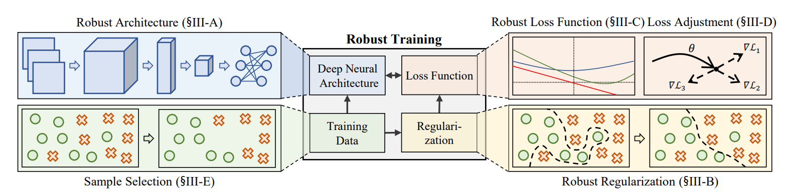
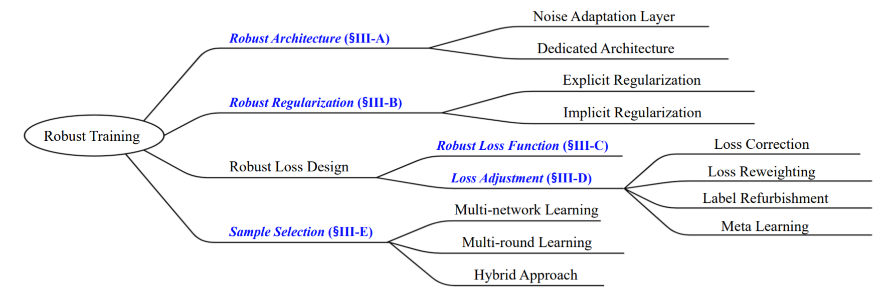

# Noisy Labels

## Repos

[subeeshvasu/Awesome-Learning-with-Label-Noise](https://github.com/subeeshvasu/Awesome-Learning-with-Label-Noise)

[songhwanjun/Awesome-Noisy-Labels](https://github.com/songhwanjun/Awesome-Noisy-Labels)

## Survey

Song H, Kim M, Park D, et al. Learning from noisy labels with deep neural networks: A survey[J]. arXiv preprint arXiv:2007.08199, 2020. [[paper]](https://arxiv.org/abs/2007.08199)

## Notes

### A High level view of robust training

