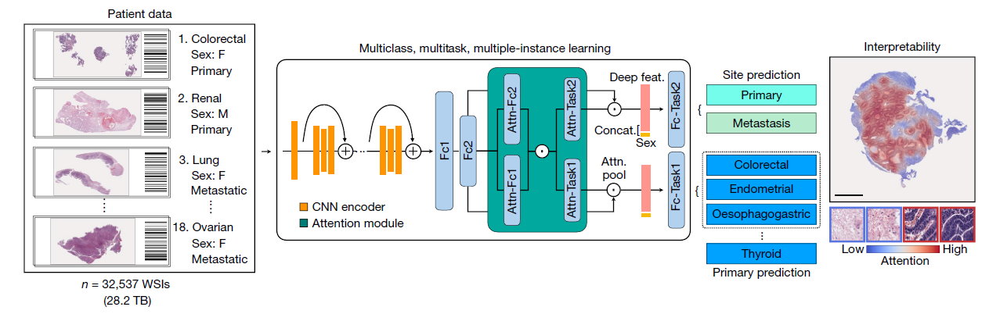





# AI-based pathology predicts origins for cancers of unknown primary

## Available Materials

- **Data**
  - TCGA diagnostic WSI data and corresponding labels: [NIH genomic data commons](https://portal.gdc.
    cancer.gov/)
  - CPTAC histology data and corresponding labels:[TCIA CPTAC Pathology Portal](https://cance
    rimagingarchive.net/datascope/cptac/)
  - Email all requests for academic use of raw and processed data to the corresponding author (and also include M.Y.L. (mlu16@bwh.harvard.edu)).
- **Code**: [mahmoodlab/TOAD](https://github.com/mahmoodlab/TOAD)

## Abstract

- **Cancer of unknown primary(CUP) origin**: an enigmatic group of diagnoses in which the **primary anatomical site of tumour origin cannot be determined.**
  - **Usually solved by**
    - **genomics**: lacks clinical penetration in low-resource settings
    - **transcriptomics**
  - **Propose**: Tumor Origin Assessment via Deep Learning(TOAD)
    - provide a **differential diagnosis** for the origin of the primary tumor 
    - using **routinely acquired histology slides**
  - **Method**
    - **Training Data**: Whole-slide images(WSI) with known primary origins
    - **Model**: simultaneously **identifies the tumour as primary or metastatic** and **predicts its site of origin**.
  - **Result**
    - **held-out test set**: top-1 accuracy of 0.83 and a top-3 accuracy of 0.96
    - **external test set**: top-1 and top-3 accuracies of 0.80 and 0.93
    - **further curated dataset** of 317 cases of CUP for which a differential diagnosis was assigned: in concordance for 61% of cases and a top-3 agreement of 82%.

## TOAD workflow

### Data

- 32537 gigapixel WSIs(22833 WSIs were used for training, 6499 WSIs were held out for test)
  - spanning **18 groups** of common primary cancer origins
  - **25,419 primary and 7,118 metastatic** WSIs from 29,107 patient; 52.8% women, 47.2% men)
  - All WSIs were processed and analysed at the **20× equivalent magnification**.
  - The dataset is randomly partitioned and is **stratified by class**, into a training set (70% of cases), a validation set (10% of cases) and a test set (20% of cases)
  - **Data sources**
    - **Publicly available data**: In total, we gathered **10,406 WSIs from 8,794 patients across 25 TCGA studies** and **2,969 WSIs from 1,151 patients across 7 CPTAC studies**
    - **In-house data**: **19,162 WSIs (12,215 primary, 6,947 metastatic)** from internal patients at the Brigham and Women’s Hospital
- **External test set**: 682 samples from more than 200 medical centres
- **Additional CPU test dataset**: 317 cases of CUP that were assigned a primary differential based on ancillary tests, radiology, patient history, clinical correlation or at autopsy

### TOAD model architecture

- **Purpose**: to simultaneously predict the origin of the tumour in each WSI and whether it was the primary tumour or a metastasis.

- **Technique**: a form of weakly supervised machine learning known as **multiple instance learning**

  - considering each WSI as a **collection (known as a bag)** of **smaller image regions (known as instances)**

- **Workflow**
  1. **WSI processing**: tissue segmentation and patching
  
  2. **Dimensionality reduction**: patch --> fixed pretrained ResNet50 --> 1024-dimensional feature vector
  
  3. **Multitask attention pooling**
  
     - **Task1: Primary Prediction (18 groups)**, **Task2: Site Prediction(Primary vs Metastatic)**
  
     - **FC1**: $W_1\in\mathbb{R}^{512\times1024}, b_1\in\mathbb{R}^{512}$
     - **FC2**:$W_2\in\mathbb{R}^{512\times512}, b_2\in\mathbb{R}^{512}$
     - $h_k=ReLU(W_2(ReLU(W_1z_k+b_1))+b_2)\in\mathbb{R}^{512}$
     - $h_{slide,t}\in\mathbb{R}^{512}=\sum{a_{k,t}h_k}$​​, $t\in\{1,2\}$​​indicates tasks, $a_{k,t}$​​​indicates attention​
     - $a_{k,t}=\frac{exp\{W_{a,t}(tanh(V_ah_k))\odot sigm(U_ah_k)\}}{\sum_{j=1}^N{exp\{W_{a,t}(tanh(V_ah_j))\odot sigm(U_ah_j)\}}}$​
  
  4. **Late-stage fusion and classification**
     - incorporate the biological sex of each patient into the prediction
     - $p_t=softmax(W_{cls,t}concat([h_{slide,t},s])+b_{cls,t})$​
     
  5. **Multi-task Loss**
     - $\mathcal{L}_{total}=c_1\mathcal{L}_{cls,1}+c_2\mathcal{L}_{cls,2}$​
     - $c_1=0.75, c_2=0.25$​ give better performance

## Evaluation of model performance

- **Top-k** Performance

  The high top-k accuracy suggests that we can potentially use the top predictions of TOAD for a given slide to narrow down the origin of the tumor to a handful of possible origins

  TOAD was able to predict whether the tumour specimen is a metastasis with an **accuracy of 85.0%** and **AUC of 0.942**

  

- Primary versus metastasis performance

  

- **Generalization** to external test cohort

  **Without tuning or domain adaptation**, our trained model produced an accuracy of 79.9% and a top-3 accuracy of 93.4%

  Similarly, on the second task of distinguishing between a metastasis and a primary tumour, the model had an **AUC of 0.919**

- **Confusion Matrix** on **held-out test set**

  

- **fraction of samples** that was correctly classified

  
  
- Micro-averaged one-versus-rest ROC(Left) and primary versus metastasis ROC(Right)

  

- Further analysis of the model predictions on the test set (n = 6,499)

  

