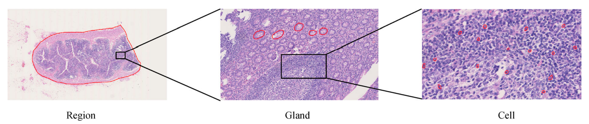
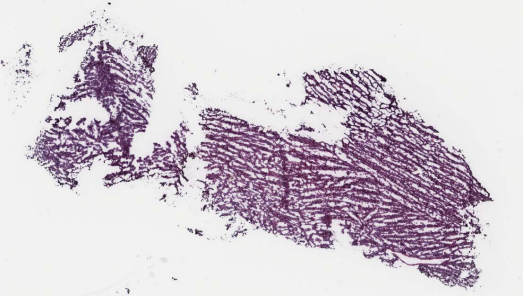
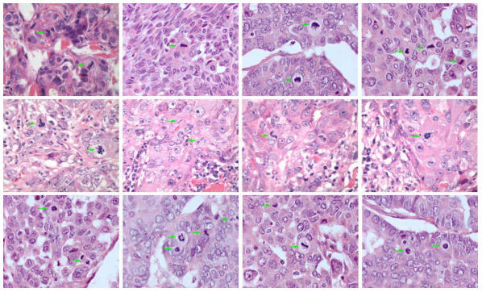
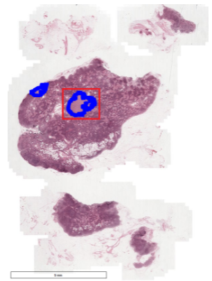
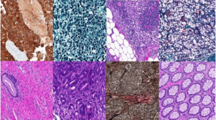
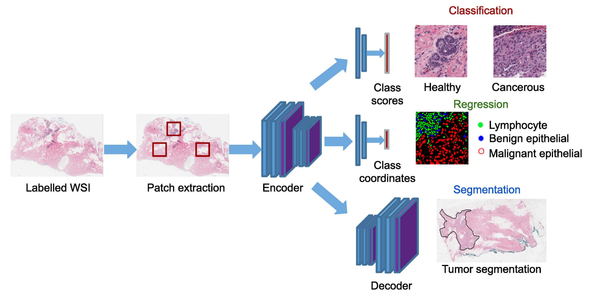
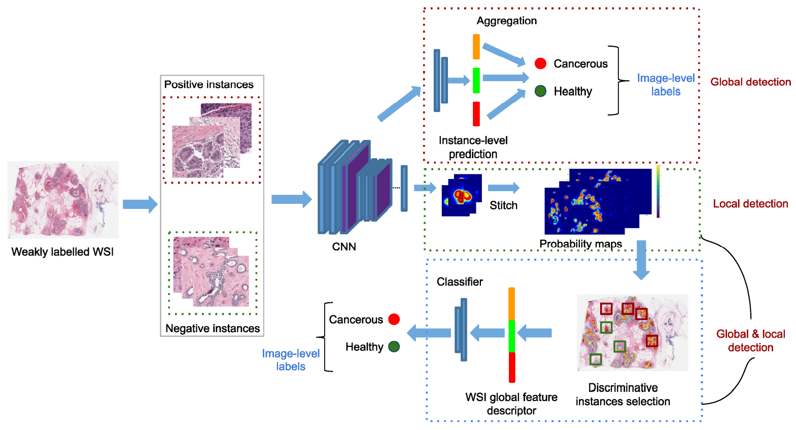
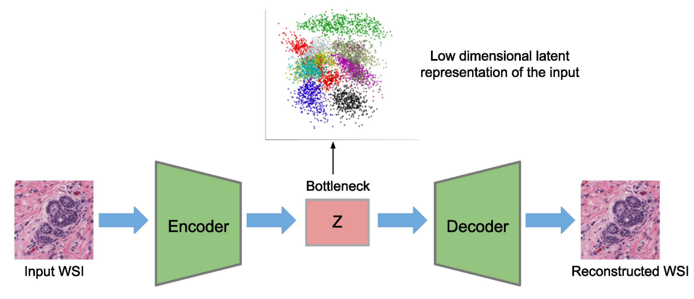

# Pathology

This article is a sum-up of three surveys of digital pathology image analysis[^1][^2][^3]. I mainly followed the structure of the MIA research[^1] and used the other two[^2][^3] as supplement.

## Tasks

## Dataset

| Dataset                                                      | Field            | Size         | Sample                                                       |
| ------------------------------------------------------------ | ---------------- | ------------ | ------------------------------------------------------------ |
| [TCGA](https://www.cancer.gov/about-nci/organization/ccg/research/structural-genomics/tcga/using-tcga) | Cancer related   | > 470 TB     |  |
| [TUPAC16](https://tupac.grand-challenge.org/Dataset/)        | Tumor mitosis    | ≈ 821 slides |  |
| [Camelyon](https://camelyon17.grand-challenge.org/Data/)     | Breast cancer    | ≈ 3 TB       |  |
| [Kimia Path24](https://kimialab.uwaterloo.ca/kimia/index.php/pathology-images-kimia-path24/) | Pathology Images | 24 WSIs      |  |

## Methodology

### Supervised Learning

### Weekly Supervised Learning

### Unsupervised Learning

### Transfer Learning

---

**Reference**

[^1]: Srinidhi, Chetan L., Ozan Ciga, and Anne L. Martel. "Deep neural network models for computational histopathology: A survey." *Medical Image Analysis* (2020): 101813. [[paper]](https://arxiv.org/pdf/1912.12378.pdf)

[^2]: Deng, Shujian, et al. "Deep learning in digital pathology image analysis: A survey." *Frontiers of medicine* (2020): 1-18. [[paper]](https://journal.hep.com.cn/fmd/EN/article/downloadArticleFile.do?attachType=PDF&id=27600)

[^3]: Li, Chen, et al. "A State-of-the-art Survey of Artificial Neural Networks for Whole-slide Image Analysis: from Popular Convolutional Neural Networks to Potential Visual Transformers." *arXiv preprint arXiv:2104.06243* (2021). [[paper]](https://arxiv.org/pdf/2104.06243.pdf)

