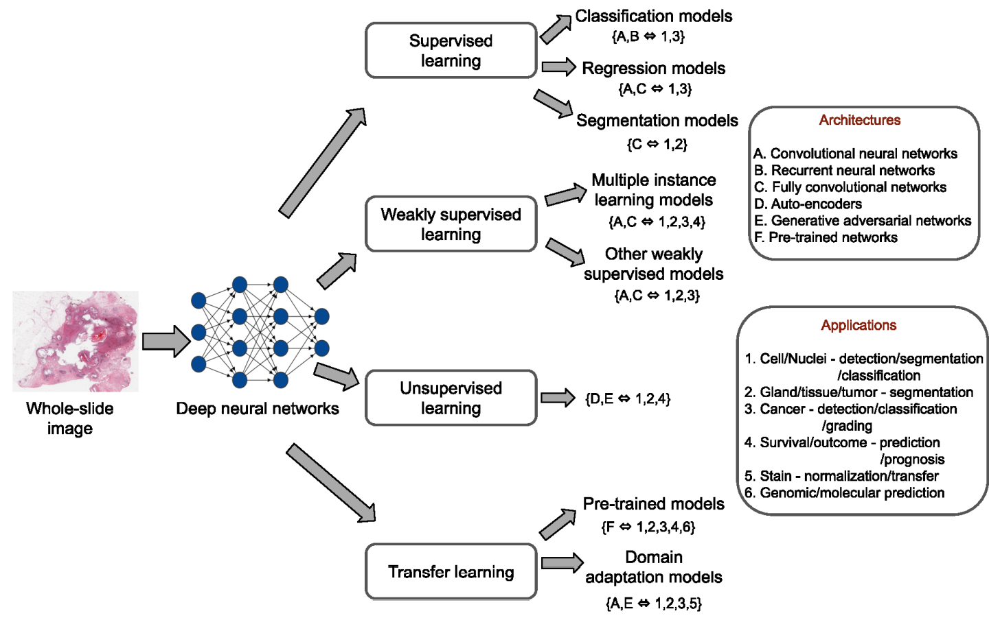

# Pathology

This article is a sum-up of three surveys of digital pathology image analysis[^1][^2][^3]. I mainly followed the structure of the MIA research[^1] and used the other two[^2][^3] as supplement.

## Tasks

## Dataset

## Methodology

### Supervised Learning

### Weekly Supervised Learning

### Unsupervised Learning

### Transfer Learning

---

**Reference**

[^1]: Srinidhi, Chetan L., Ozan Ciga, and Anne L. Martel. "Deep neural network models for computational histopathology: A survey." *Medical Image Analysis* (2020): 101813. [[paper]](https://arxiv.org/pdf/1912.12378.pdf)

[^2]: Deng, Shujian, et al. "Deep learning in digital pathology image analysis: A survey." *Frontiers of medicine* (2020): 1-18. [[paper]](https://journal.hep.com.cn/fmd/EN/article/downloadArticleFile.do?attachType=PDF&id=27600)

[^3]: Li, Chen, et al. "A State-of-the-art Survey of Artificial Neural Networks for Whole-slide Image Analysis: from Popular Convolutional Neural Networks to Potential Visual Transformers." *arXiv preprint arXiv:2104.06243* (2021). [[paper]](https://arxiv.org/pdf/2104.06243.pdf)

