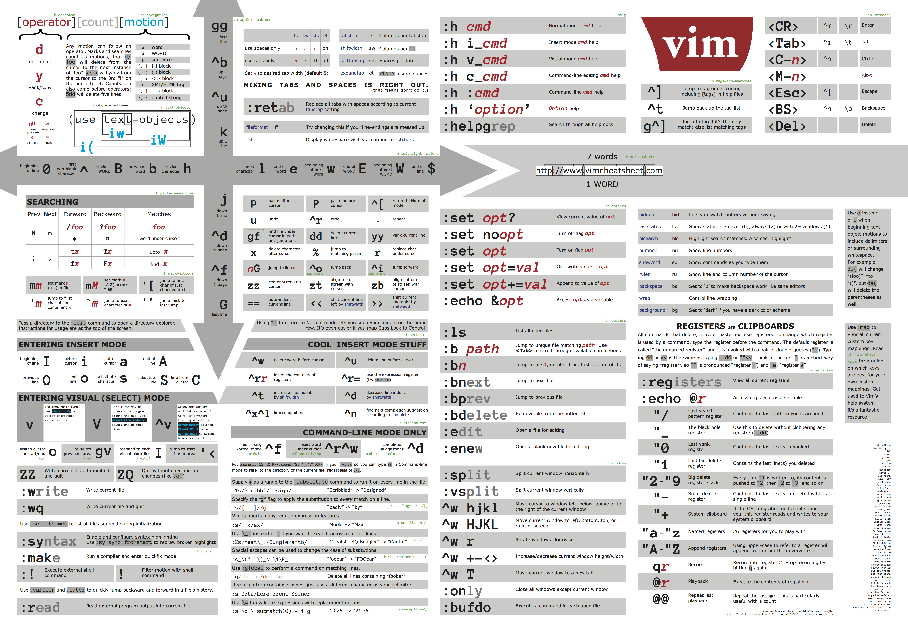

# Vim8 and NeoVim

## Vim

### Setup .vimrc
- vim use ```/home/<username>/.vimrc``` file to config vim
- an example of ```.vimrc```
  ```bash
  syntax on 					" Enable syntax highlighting.
  filetype plugin indent on 	" Enable file type based indentation.
  
  set autoindent 				" Respect indentation when starting a new line.
  set expandtab 				" Expand tabs to spaces. Essential in Python.
  set tabstop=4 				" Number of spaces tab is counted for.
  set shiftwidth=4 			" Number of spaces to use for autoindent.
  
  set backspace=2 			" Fix backspace behavior on most terminals.
  
  colorscheme murphy 			" Change a colorscheme.
  ```
  
- type ```:``` followed by a command to try a setting, for example```:set autoindent```

- type ```:``` followed by a setting and ```?``` to check its value, for example```:set tabstop?```

- supported color themes for Vim8: 

  ```blue, darkblue, default, delek, desert, elflord, evening, industry, koehler, morning, murhpy, pablo, peachpuff, ron, shine, slate, torte, zellner```

### Operations


- "word" and "WORD"

  - both are sequence separated by white space

  - "word" is consist of letters, digits, and underscores

  - "WORD" is consist of any non-blank characters
