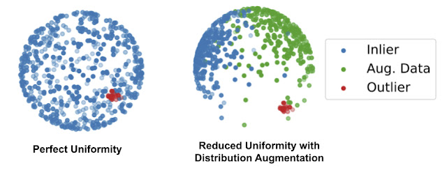
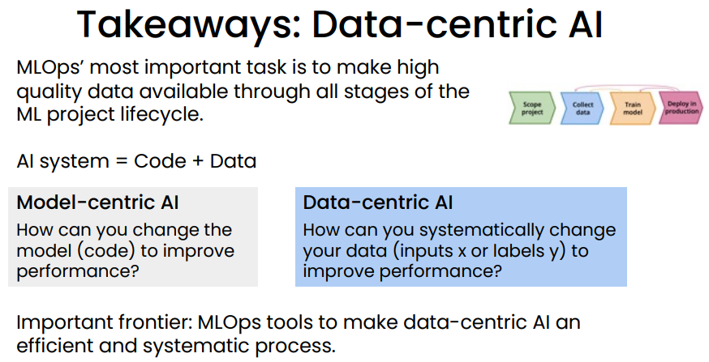

# Machine Learning Researches

## 2021.09.23

### Synced: [UMass Amherst & Google Improve Few-Shot Learning on NLP Benchmarks via Task Augmentation and Self-Training](https://syncedreview.com/2021/09/23/deepmind-podracer-tpu-based-rl-frameworks-deliver-exceptional-performance-at-low-cost-110/)

[[paper]](https://arxiv.org/pdf/2109.06270.pdf)

### Google AI: [High-Quality, Robust and Responsible Direct Speech-to-Speech Translation](http://ai.googleblog.com/2021/09/high-quality-robust-and-responsible.html)

[[paper]](https://arxiv.org/pdf/2107.08661.pdf)

## 2021.09.22

### :star:Google AI: [Pathdreamer: A World Model for Indoor Navigation](http://ai.googleblog.com/2021/09/pathdreamer-world-model-for-indoor.html)

[[paper]](https://arxiv.org/abs/2105.08756)

**Keywords**: indoor navigation

**Comment**: Super Cool!

## 2021.09.20

### :star:Synced: [DeepMind’s Bootstrapped Meta-Learning Enables Meta Learners to Teach Themselves](https://syncedreview.com/2021/09/20/deepmind-podracer-tpu-based-rl-frameworks-deliver-exceptional-performance-at-low-cost-107/)

## 2021.09.16

### :star:Google AI: [Toward Fast and Accurate Neural Networks for Image Recognition](http://ai.googleblog.com/2021/09/toward-fast-and-accurate-neural.html)

[[paper1: EfficientNetV2]](https://arxiv.org/pdf/2104.00298.pdf) [[paper2: CoAtNet]](https://arxiv.org/pdf/2106.04803.pdf) [[code]](https://github.com/google/automl)

**Keywords**: neural architecture search;

**Comment**: Super Cool!

### Synced: [UC Berkeley Uses a Causal Perspective to Formalise the Desiderata for Representation Learning](https://syncedreview.com/2021/09/16/deepmind-podracer-tpu-based-rl-frameworks-deliver-exceptional-performance-at-low-cost-105/)

[[paper]](https://arxiv.org/pdf/2109.03795.pdf)

**Keywords**: representation learning; non-spuriousness; disentanglement 

**Comment**: Too much terminology that I don‘t understand. Mark and read it later.

### Marktechpost: [Israeli Researchers Unveil DeepSIM, a Neural Generative Model for Conditional Image Manipulation Based on a Single Image](https://www.marktechpost.com/2021/09/16/israeli-researchers-unveil-deepsim-a-neural-generative-model-for-conditional-image-manipulation-based-on-a-single-image/)

[[project page]](http://www.vision.huji.ac.il/deepsim/) [[paper]](https://arxiv.org/pdf/2109.06151.pdf) [[code]](https://github.com/eliahuhorwitz/DeepSIM)

**Comment**: Experiment results are astonishing. Mark and read later.

## 2021.09.15

### Google AI: [Revisiting Mask-Head Architectures for Novel Class Instance Segmentation](http://ai.googleblog.com/2021/09/revisiting-mask-head-architectures-for.html)

[[project page]](https://google.github.io/deepmac/) [[paper]](https://arxiv.org/pdf/2104.00613.pdf) [[partially supervised segmentation paper]](https://arxiv.org/pdf/1711.10370.pdf)

**Keywords**: instance segmentation; partially supervised instance segmentation

**Summary**: 

Instance segmentation is an important task to many downstream applications. Collecting large labeled instance segmentation dataset is time consuming. Partially supervised instance segmentation target to tackle the challenge but requires a **stronger form of model generalization** to handle **novel classes not seen at training time**. This paper proposed two easy-to-implement fixes (one training protocol fix, one mask-head architecture fix) based on Mask R-CNN like network that work in tandem to close the gap to fully supervised performance. *While neither of these ingredients have a large impact on the classes for which masks are available during training, employing both leads to significant improvement on novel classes for which masks are not available during training.* In a nutshell, **cropping exclusively to ground true boxes during training** and **using deep hourglass mask heads with 50 or more layers** brought significant performance improvement to unseen classes.

**Comment**: I haven't read the paper yet. I hope there will be more discussion about why these two fix would bring better performance to unseen classes. Otherwise it's just a technical report.

## 2021.09.09

### Google AI: [Personalized ASR Models from a Large and Diverse Disordered Speech Dataset](http://ai.googleblog.com/2021/09/personalized-asr-models-from-large-and.html)

[[paper1]](https://www.isca-speech.org/archive/interspeech_2021/macdonald21_interspeech.html) [[paper2]](https://www.isca-speech.org/archive/interspeech_2021/green21_interspeech.html)

**Keywords**: Automatic speech recognition (ASR)

**Summary**: 

With over 1 million utterances, Euphonia’s corpus is one of the largest and most diversely disordered speech corpora (in terms of disorder types and severities) and has enabled significant advances in ASR accuracy for these types of atypical speech. The results demonstrate the efficacy of personalized ASR models for recognizing a wide range of speech impairments and severities, with potential for making ASR available to a wider population of users.

## 2021.09.02

### :star:Google AI: [Discovering Anomalous Data with Self-Supervised Learning](http://ai.googleblog.com/2021/09/discovering-anomalous-data-with-self.html)

[[paper1]](https://arxiv.org/pdf/2011.02578.pdf) [[paper2: CutPaste]](https://arxiv.org/pdf/2104.04015.pdf) [[code]](https://github.com/google-research/deep_representation_one_class)

**Keywords**: anomaly detection; self-supervised learning; one-class classification

**Summary**: 

The assumption of anomaly detection or the abstract of the problem one-class classification is that you have a large amount of normal examples and only a few anomalous data. The first paper aims to combine traditional one-class classifier with self-supervised learning for feature extraction. A distribution augmentation (DA) method is proposed to separate outlier from inlier while contrastive learning tend to spread out normal examples uniformly on a sphere.

The second paper is designed a cut and paste method for self-supervised learning.

**Comment**: With a fast glance of the blog, the idea of combining one-class classifier with self-learning feature extractor is trivial. The proposed distribution augmentation (DA) to separate outliers from inlier is interesting but lack of persuasion because the situation when both inliers and augmented data are uniformly spread out on a sphere isn't excluded. The second paper is more of an adaptation for defect detection of the first paper.  

## 2021.05.06

### :star:DeepMind: [Game theory as an engine for large-scale data analysis](https://deepmind.com/blog/article/EigenGame)

**Keywords**: 

**Summary**:

## 2021.03.25

### Andrew Ng: [A Chat with Andrew on MLOps: From Model-centric to Data-centric AI](https://www.youtube.com/watch?v=06-AZXmwHjo)

[[slide]](https://www.deeplearning.ai/wp-content/uploads/2021/06/MLOps-From-Model-centric-to-Data-centric-AI.pdf)

**Keywords**: data-centric

**Summary**:

MLOps’ most important task: Ensure consistently high-quality data in all phases of the ML project lifecycle. Good data is: 

- Defined consistently (definition of labels y is unambiguous) • Cover of important cases (good coverage of inputs x) 
- Has timely feedback from production data (distribution covers data drift and concept drift) 
- Sized appropriately

**Comment**: Like Andrew said in the webinar, we took 80% of time preparing high quality data but only 1% of AI research is about data. It would be more encouraging to see more researches about how data quality affect model performance.

## 2021.01.05

### :star:OpenAI: [CLIP: Connecting Text and Images](https://openai.com/blog/clip/)

**Keywords**: 

**Summary**:

### :star:OpenAI: [DALL·E: Creating Images from Text](https://openai.com/blog/dall-e/)

**Keywords**: 

**Summary**:

## 2020.06.17

### :star:OpenAI: [Image GPT](https://openai.com/blog/image-gpt/)

**Keywords**: 

**Summary**:

